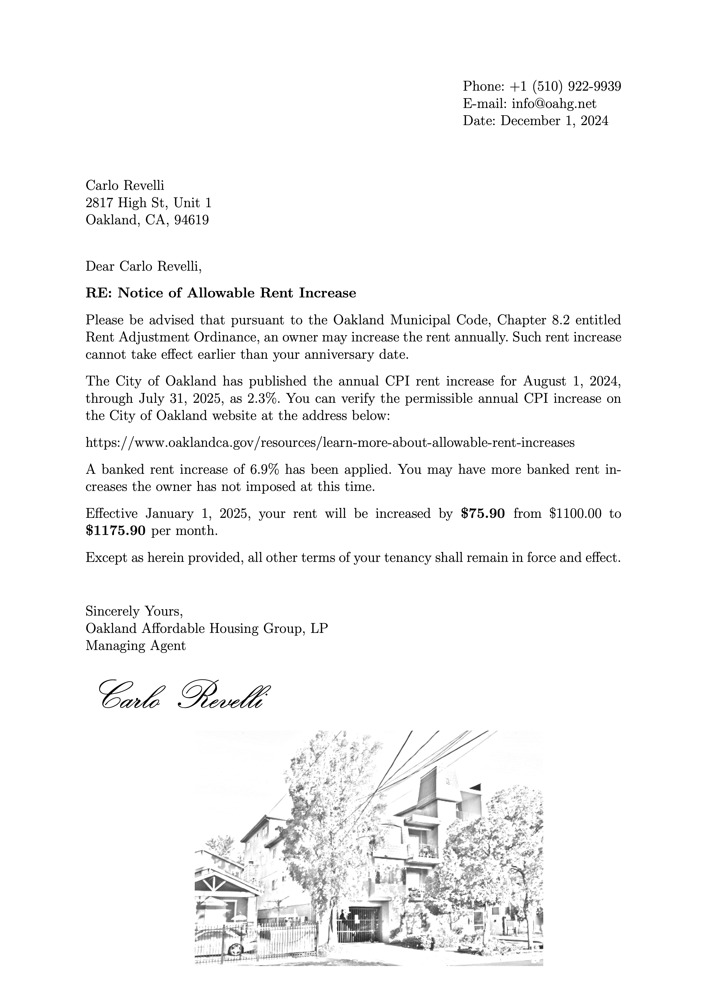

# Installation

First download the code

```
git clone git@github.com:frosty00/rent-increases.git
```

Next install the dependencies (on mac)

```
brew install node npm
cd rent-increases
npm install .
```

Finally, install a latex compiler (on mac)

```
brew install mactex
```

# Usage

First export data from rent manager into a file called `tenant-data.csv` and so that it has 5 columns. Name, unit, lease start, base rent, current rent.

Next run the following command

```
node --loader ts-node/esm tex-template.ts
```

This will generate the rent increase pdfs.

# Example

This is an example of the output generated by the computer program:



And this is the format of the [Input](tenant-data.csv) data that the program used to generate the data:

The output template can be customized easily to change the address of the property and signature, and the image at the bottom.

This is the [Template](template.tex) from which the pdfs are generated. The template is fully customizable.
